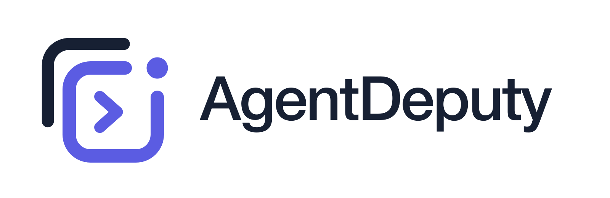

# AgentDeputy



**让 AI 继续工作，你不用守着对话窗口。**

AgentDeputy 是一款 macOS 状态栏应用，汇集本机 AI 编程客户端的任务状态。切到别的工作时，你仍能看到任务是否在运行、何时完成，以及是否需要回答问题或确认权限。

## 一眼掌握任务进度

- **状态栏入口**：查看正在运行的任务与额度。任务运行时，AgentDeputy Logo 会播放轻量动画；鼠标悬停可快速查看当前任务和额度。
- **任务列表**：按客户端查看正在运行和最近的对话，包括任务名称、用户消息预览、模型、effort、运行时长或完成时间。可从任务卡片回到对应对话。
- **完成提醒**：任务结束时在屏幕上弹出可点击的提醒。你可以选择提醒位置、进入和退出动画、速度与停留时长，也可以在客户端位于前台时关闭提醒。
- **需要你处理时提醒**：Codex 会话等待交互式回答或权限确认时显示提醒。权限请求可在提醒中选择同意一次、拒绝，或打开 Codex 处理。
- **多账号与额度**：管理并手动切换 Codex / ChatGPT、Claude Code 账号；Codex 账号可查看额度与重置时间。运行中的任务会阻止账号切换，避免打断工作。

目前支持 **Codex / ChatGPT** 和 **Claude Code** 的本地任务。AgentDeputy 监听的是客户端中的工作任务；模型名称和 effort 显示为任务信息，不把普通网页聊天当成可运行任务。

## 开始使用

1. 从 [Releases](https://github.com/qyuja/Kestra/releases) 下载最新的 macOS DMG，将 AgentDeputy 拖入“应用程序”并打开。
2. 点击状态栏中的 AgentDeputy 图标，在设置中选择要显示的客户端，并连接相应的本地任务来源。
3. 开始一个 Codex 或 Claude Code 任务。切换到其他窗口后，使用状态栏和悬停浮窗查看进度；完成或需要操作时会收到提醒。

首次使用 Codex 权限提醒，需要在设置中连接 Codex 交互提醒，并在 Codex 的 `/hooks` 中信任新 Hook。交互式问答提醒从本地会话读取，不需要这一步。Claude Code 任务提醒需在设置中连接其 Hooks。

要求 macOS 26 或更新版本。如果 macOS 首次阻止打开下载的应用，可在 Finder 中右键应用并选择“打开”。

## 按自己的习惯设置

- 自定义状态栏图标、任务预览显示第一条或最后一条用户消息，以及浅色、深色或跟随系统的主题。
- 为完成提醒单独设置出现位置、进入动画、退出动画、动画速度和停留时长；可直接在设置中播放预览。
- 选择是否开机自启动、自动检查新版本，并在有新版本时从应用内下载更新。
- 可选开启 Codex 额度重置后的简短问候。开启后，检测到额度窗口重置时会向对应账号发送一次真实请求。

## 隐私

任务监听和界面展示在本机完成，AgentDeputy 不会把任务标题、对话摘要或提醒事件上传到自己的服务。Codex 与 Claude Code 仍按各自的客户端协议连接其服务。

## 从源码构建

需要 macOS 26 与 Swift 6.2 或更新版本：

```bash
git clone https://github.com/qyuja/Kestra.git AgentDeputy
cd AgentDeputy
swift test
./script/build_and_run.sh
```

脚本会构建并打开独立的开发版，不会替换已安装的正式应用。

## 许可证

AgentDeputy 源码采用 [MIT License](LICENSE)。第三方图标和商标不在本项目的 MIT 授权范围内，使用时需遵守各自的授权条款。
